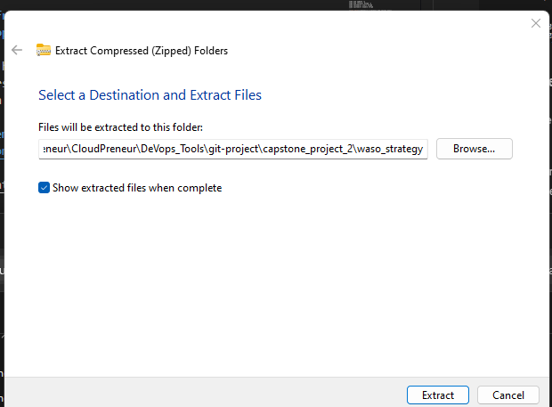

# Capstone Project - Introduction to Cloud Computing

## This is an E-Commerce Platform Deployment with Git, Linux, and AWS:

### Project Instruction:
I will be developing an e-commerce website for a new online marketplace named "MarketPeak." The platform will feature product listings, a shopping cart, and user authentication. 
I will utilise Git for version control, develop the platform in a Linux environment, and deploy it on an AWS EC2 instance. 

## Step 1: Development On Local Workstation

### Tasks 1: Implement Version Control with Git

#### 1.1. Git Repository Initialization:
I created a new directory OR folder "MarketPeak_Ecommerce" with the mkdir command and then cd into the new project directory and ini it as a git repository using the git 'init command'. 

N:B tO carry out this project, I have optionS of using command line terminal of choice, but because I am using windows work station, I will be using "gitbash" AND "COMMAND PROMPT" which will allow me to run some shell commands on Windows.


```
mkdir MarketPeak_Ecommerce
cd MarketPeak_Ecommerce
git init

```


### Tasks 2: Get Source code from template.com:
#### 2.1. Local Website Development | Obtain and Prepare the E-Commerce Website Template: 
As a DevOps Engineer, I don't have to develop the website code because it is done by web/software developers. Instead of spending more time developing the website from scratch, I used a pre- existing e-commerce website template.

#### 2.2 Download a Website Template: The website template was downloaded from [Here](https://www.tooplate.com/view/2130-waso-strategy) 


#### 2.3 Prepare the Website Template: Extract the downloaded template into your project directory



N:B I used GUI because i find it easier but i can aswell use a linux command "unzip waso_strategy.zip"


### Tasks 3: Stage and Commit the Template to Git:
#### 3.1.  Git Commit:
I successfully add and commit the changes.
I used "git add to add my website files to the Git repository and "git commit commands" to commit my changes with a clear message.

```
git add .
```


After which i configured the global Git settings with "git config --global" with username and email address.

```
git config --global user.name "YourUsername"
git config --global user.email "youremail@example.com"
git commit -m "Initial commit with basic e-commerce site structure"

```


### Task 4: Pushing the code to Github repository

After completing my git activities for the repository to be tracked by git on our local workstation (machine).

In order not to lose the work, i will move the work to a git repository by carrying out the following steps:

#### 4.1 Create a Remote Repository on GitHub: 
1. Log into your GitHub account and create a new repository named "MarketPeak_Ecommerce" Leave the repository empty without initializing it with a README, .gitignore, or license.


#### 4.2 Link Your Local Repository to GitHub: 
In the terminal, within my project directory, i added (linked) the remote repository URL to my local repository configuration.

```
git remote add origin https://github.com/Saxangel/MarketPeak_Ecommerce.git
```


#### 4.3 Push your code to GitHub repository: 
I pushed my code to github repository using the following command: this can be seen in the above diagram.

```
git push -u origin main
```
---

## Step 2: AWS Deployment
### Task 1: Setup an AWS EC2 instance for deployment

1. Log in to the AWS Management Console.
2. Launch an EC2 instance using an Amazon Linux AMI.
3. Connect to the instance using SSH.
### N:B that I used my existing security group that has both port 22 and port 80 opened. I also used existing keypair


### Task 2: Clone the repository on the Linux Server

Before deploying the e-commerce platform, I cloned the GitHub repository to your AWS EC2 instance. This process involves authenticating with GitHub and choosing between two primary methods of cloning a repository: SSH or HTTPS.

#### 2.1 Authenticating with GitHub using ssh

On your EC2 instance, generate SSH keypair using "ssh-keygen" as shown

```
ssh-keygen
```


#### 2.2 cat and copy the public key:

```
cat /home/ec2-user/.ssh/id_rsa.pub
```


#### 2.3 Adding ssh public key to GitHub repository: File Transfer to EC2

Go to settings on Github and click on ssh and Gkeys as shown in the image abouve.

```
git clone git@github.com:Saxangel/MarketPeak_Ecommerce.git
```
---

# OR

#### 2.4 Authenticating with GitHub using HTTPS

For repositories cloned without setting up SSH keys, use the HTTPS URL. GitHub will prompt for your username and password:

N:B github.com no longer accept password, so you will have to generate tokens

```
git clone https://github.com/Saxangel/MarketPeak_Ecommerce.git 
```


N:B: With AWS redhat, git is not preinistalled so I have to install it manually, using the following command:

```
sudo yum install git -y 
```

### Task 3: Installing a Web Server on EC2

Apache HTTP Server (httpd) is a widely used web server that serves HTML files and content over the internet. Installing it on Linux EC2 server allows you to host MarketPeak E-commerce site:

#### 3.1 Install Apache web server on the EC2 instance: Note that httpd is the software name for Apache on redhats systems using yum package manager

I will use the following command to install the Apache web server on EC2 instance:

```
sudo yum update -y
sudo yum install httpd -y
sudo systemctl start httpd
sudo systemctl enable httpd 
```


#### 3.2 Configure httpd for Website:

- I prepared the Web Directory by clearing the default httpd web directory and copying MarketPeak Ecommerce website files to it.

```
sudo rm -rf /var/www/html/*  #Delete the default
sudo cp -r ~/MarketPeak_Ecommerce/* /var/www/html/ #copy the content of MarketPeak_Ecommerce cloned earlier 
```

- Reload httpd: Apply the changes by reloading the httpd service.


```
sudo systemctl reload httpd 
```


### Task 4: Website Access:
Access the Website from a browser With httpd configured and website files in place. MarketPeak Ecommerce platform is now live on the internet: Open a web browser and access the public IP (http://34.229.240.50/2130_waso_strategy/) of your EC2 instance to view the deployed website.

N:B HTTP port 80 must be opened in AWS security group.


## Step 3: Continuous Integration and Deployment Workflow
In order to ensure a smooth workflow for developing, testing, and deploying my e-commerce platformI followed a structured approach which covers making changes in a development environment, utilizing version control with Git, and deploying updates to your production server on AWS.

### Task 1: Developing New Features and Fixes

#### 1.1 Create a Development Branch: 
I created a new branch called "development" in other to make changes to the website using the "checkout command". This isolates new features and bug fixes from the stable version of the website in the master.

```
git branch development
git checkout development
```


#### 1.2 Implement Changes and continued development:
On the development branch, i added my new features **(Text and Colour was changed)**. 

### Task 2: Version control with Git

Run the following git command to stage, commit, and push to development branch:

```
git add .

git commit -m "Add new features"

git push origin development
```


### Task 3: Pull Requests and Merging to the Main branch

#### 3.1 Create a Pull Request (PR): 
On GitHub, I created a pull request to merge the development branch into the main branch. This process is crucial for code review and maintaining code quality.


### 3.2 Review and Merge the PR: 
I reviewed the changes for any potential issues. Once satisfied, i then merged the pull request into the main branch, incorporating the new features into the production codebase.


```
git checkout main
git merge development
```


### 3.3 Push the Merged Changes to GitHub: 
I ensured that my local main branch containing the updates is pushed to the remote repository on GitHub
```
git pull

git push origin main
```


## Task 4: Deploying Updates to the Production Server

### 4.1 Pull the Latest Changes on the Server: 
SSH into your AWS EC2 instance where the production website is hosted. Navigate to the website's directory and pull the latest changes from the main branch.

```
ssh -i C:\Users\Saxangel\Desktop\CloudPreneur\CloudPreneur\DeVops_Tools\git-project\capstone_project_2\MarketPeak_Ecommerce.pem ec2-user@34.229.240.50
```


```
git pull origin main
```


### 4.2 Restart the Web Server (if necessary): 
Depending on the nature of the updates, you may need to restart the web server to apply the changes but in my case, i restarted the server.

```
sudo rm -rf /var/www/html/*
sudo cp -r ~/MarketPeak_Ecommerce/2137_barista_cafe/* /var/www/html/
```

```
sudo systemctl reload httpd
```


### Task 5: Testing the New Changes

#### 5.1 Access the Website: 
I tested the new feature by opening a web browser and navigated to the public IP address of your EC2 instance. The new feature should display as expected.


This workflow shows the best practices in software development and deployment, including branch management, code review through pull requests, and continuous integration/deployment strategies. By following these steps, you can maintain a stable and up-to-date production environment for your e-commerce platform.


### 6. Challenges:
I encountered series of challenges during this projects

- Some of the challenges i faced include not knowing which platform is best to choose for the coding. So, i was juggling between VScode, CMD and EC2 instance (Linux server)

- I had to go through my book in order to remeber some commands and also seek help from my mentors to complete all the task.